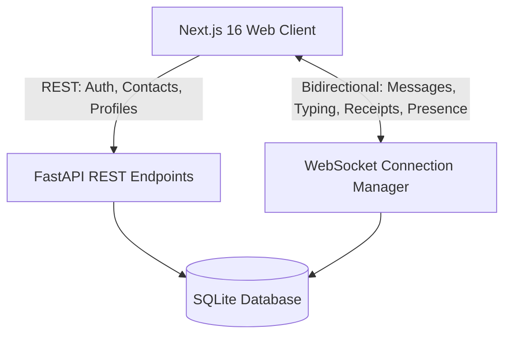

# Signal Clone (Cipher Messenger) — Secure Messaging Platform

A full-featured, privacy-focused messaging application inspired by **Signal Messenger**. Built as a modern pair of a **FastAPI** real-time backend and a **Next.js 16 (App Router) + TypeScript + Tailwind CSS** frontend.


---

## 🌟 Key Features

- **🔐 Privacy & Simulated End-to-End Encryption**: Clean privacy-first design language, encrypted message storage simulation, and Signal safety banners.
- **⚡ Real-time Bidirectional WebSockets**:
  - Instant message sending & receipt delivery without page refresh.
  - Live typing indicators ("Alex is typing...").
  - Message delivery progression: Sent (`✓`) → Delivered (`✓✓`) → Read (`✓✓` in blue).
  - Online/offline presence indicators.
- **💬 Direct & Group Chats**:
  - One-on-one direct chats with automatic conversation deduplication.
  - Multi-user group conversations with admin management (add/remove members, roles).
  - Message editing and deletion.
- **👥 Contact Management & Search**:
  - Global user search by username and display name.
  - Add/remove contacts.
- **🎨 Signal-Identical UI / UX**:
  - Signal Blue accent (`#2C6BED`).
  - Dark mode and light mode with system preference auto-detection.
  - Responsive layout for desktop, tablet, and mobile.
  - Quick one-click demo login buttons for instant testing.

---

## 🏗️ Architecture & Tech Stack



### Backend
- **Framework**: FastAPI (Python 3.12)
- **Database & ORM**: SQLite + SQLAlchemy 2.0 (WAL mode & foreign key enforcement)
- **Authentication**: JWT Bearer Tokens (HS256) with mock OTP verification
- **Real-Time**: Native WebSockets with connection tracking and channel broadcasting
- **Testing**: Pytest test suite with in-memory SQLite fixtures

### Frontend
- **Framework**: Next.js 16 (App Router) with React 19
- **Language**: TypeScript 5
- **Styling**: Tailwind CSS 4 with custom dark mode and Signal tokens
- **Icons**: Lucide React
- **State Management**: React Contexts (`AuthContext`, `ChatContext`, `ThemeContext`)

---

## 🚀 Quick Start

### 1. Backend Setup

```bash
cd backend

# Create virtual environment (optional)
python -m venv venv
# On Windows:
venv\Scripts\activate
# On Linux/macOS:
source venv/bin/activate

# Install dependencies
pip install -r requirements.txt

# Seed test database (creates test users, contacts, conversations, and messages)
python seed.py

# Run backend development server
uvicorn app.main:app --reload --port 8000
```

The API docs will be available at:
- Interactive Swagger UI: `http://localhost:8000/docs`
- Health check: `http://localhost:8000/api/health`

### 2. Frontend Setup

```bash
cd frontend

# Install dependencies
npm install

# Run frontend development server
npm run dev
```

Open `http://localhost:3000` in your browser.

---

## 🧪 Pre-Seeded Demo Accounts

All demo accounts use the password: **`Password123!`**

| Display Name | Username | Phone | Description |
| :--- | :--- | :--- | :--- |
| **Alex Rivers** | `alex` | `+12025550101` | Primary user with pre-populated contacts & chats |
| **Sarah Connor** | `sarah` | `+12025550102` | Group member & active contact |
| **John Doe** | `john` | `+12025550103` | Contact with direct chat history |
| **Mike Ross** | `mike` | `+12025550104` | Security architecture group member |
| **David Clark** | `david` | `+12025550105` | Active collaborator with unread messages |
| **Emma Watson** | `emma` | `+12025550106` | Contact user |

*(Tip: On the `/login` screen, you can also click the quick one-click demo login buttons to instantly log in as any of these users.)*

---

## 🧪 Running Automated Tests

Run the full backend test suite:

```bash
cd backend
python -m pytest tests/ -v
```

Tests verify:
- Auth registration, OTP verification, and JWT session handling
- Profile updates and user search
- Contact management and duplicate protection
- Direct chat creation and deduplication
- Message sending, editing, deletion, and read receipts
- Group creation, admin permission enforcement, and member management
- Real-time WebSocket connectivity and ping/pong

---

## 📁 Repository Structure

```
Signal-clone/
├── backend/
│   ├── app/
│   │   ├── models/          # SQLAlchemy database models
│   │   ├── routers/         # API endpoint routes
│   │   ├── schemas/         # Pydantic request/response schemas
│   │   ├── services/        # Business logic & encryption
│   │   ├── websocket/       # WebSocket connection manager & event handlers
│   │   ├── config.py        # Environment settings
│   │   ├── database.py      # SQLite connection & sessionmaker
│   │   ├── dependencies.py  # Auth & DB dependencies
│   │   └── main.py          # FastAPI application entry point
│   ├── tests/               # Pytest automated test suite
│   ├── requirements.txt     # Python dependencies
│   └── seed.py              # Demo database seeder
├── frontend/
│   ├── src/
│   │   ├── app/             # Next.js App Router pages
│   │   ├── components/      # Chat, Sidebar, Modals, UI components
│   │   ├── context/         # AuthContext, ChatContext, ThemeContext
│   │   ├── lib/             # API client, WebSocket client, utils
│   │   └── types/           # TypeScript type definitions
│   ├── package.json
│   └── tailwind.config.js
└── README.md
```
